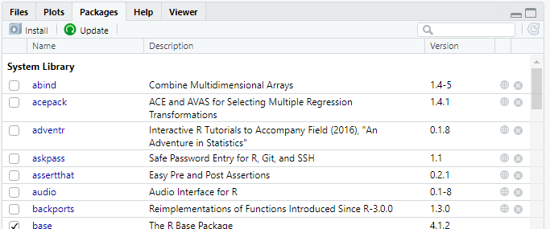
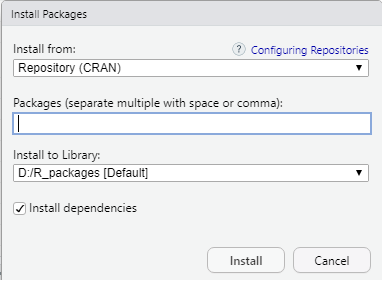
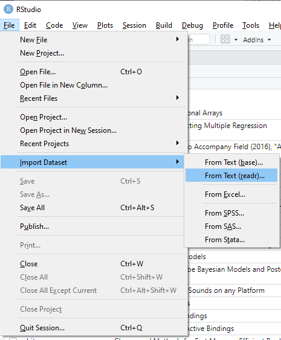
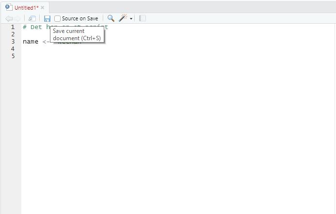

# Introduktion til R (del 1)

*4. semester sociologi, 2022*

## Hvad er R?

R er et gratis analyseprogram med sit eget kommandosprog.

Programmet egner sig især til kvantiative analyser og visualiseringer af kvantitative data.

R kan arbejde med mange forskellige dataformater. Da programmet er "open source", findes ufattelig mange udvidelser til programmet, der tilføjer funktioner.

## Dagens program

- RStudio miljøet
- At arbejde med R
- Objekter i R 
- Funktioner i R
- Indlæsning af funktioner fra andre pakker
- Introduktion til tabeldata (dataframes)
- Udforskning af tabeldata i R
- Simpel datahåndtering i R: Subsetting, nye variable og rekodning

## Undervisningsformat

I disse introduktioner vil vi variere mellem præsentation, demonstration og øvelser. I opfordres til at skrive med, som vi arbejder med R i lektionerne.

- Hjælp hinanden
- Sig til hvis I sidder fast
- Vi kommer rundt og hjælper undervejs

## RStudio

R i sig selv er meget begrænset. RStudio tilføjer en brugerflade ovenpå R, der gør det rarere at arbejde med. 

Man arbejder typisk i RStudio, når man bruger R.

## At arbejde med R

R har sit eget kodesprog. R fungerer ved at man skriver kommandoer i R sproget, som R derefter "fortolker". 

R (og RStudio) har en meget begrænset brugerflade. Det betyder, at næsten alt vi vil i R (statistik, visualisering osv.), skal ske ved at skrive koder i R sproget.

### R som lommeregner
Hvad menes med at R "fortolker" kode?

"Fortolkning" i R er blot et spørgsmål om R forstår, hvad du forsøger at gøre. Man får R til at gøre ting ved at skrive kommandoer. Hvis R forstår det, gør R den ting. Hvis R ikke forstår det, får man en fejl.

R kan fx forstå matematiske operationer:


```R
7 * 6
```


42


```R
912 - 132
```


780


R kan dog ikke forstå tilfældige kommandoer:


```R
lav min eksamensopgave
```


    Error in parse(text = x, srcfile = src): <text>:1:5: uventet symbol
    1: lav min
            ^
    Traceback:
    


## Brug af R scripts

Script filer er tekst filer med kode, som R kan forstå/fortolke.

En script-fil kan forstås som en "analyseopskrift", der indeholder alle kommandoer nødvendige for at foretage en analyse. Det tillader også, at man nemt kan køre kommandoer igen.

Man bør altid skrive de kommandoer, som man bruger, ind i et script. Brug derfor kun konsolvinduet til at finde frem til den rigtige kommando.

- `#` kan bruges til kommentarer (ignoreres når man kører koden)
- `Ctrl` + `Enter` (Windows), `Command` + `Enter` (Mac): Kører aktuel linje eller selektion

***BEMÆRK!*** Der er ingen fortryd-knap i R! Når koden er kørt, er ændringen sket. Den eneste måde at "fortryde" er ved at genskabe det, som man har lavet, ved at køre tidligere kode igen. Netop derfor er scripts vigtige.

## R Sproget: Objekter og funktioner

R fungerer ved at lagre værdier og information i "objekter". Disse objekter kan derefter bruges i forskellige funktioner. Funktioner kan være alt fra at udregne et gennemsnit, lave en figur, gemme et datasæt osv. 

Forsimplet sagt: Et objekt er en eller anden lagret information, mens en funktion er noget, som kan bearbejde eller gøre noget ved informationen i et objekt.

### Objekter

At arbejde med R involverer kontinuerligt at definere objekter. Objekter er blot et navn til at kalde lagret information frem igen.

Objekter kan være mange ting: 
- et ord
- et tal
- en talrække
- et datasæt
- en matematisk formel
- et resultat
- en filsti
- en graf
- og så videre...

Når et objekt er defineret, er det tilgængeligt i det aktuelle arbejdsmiljø (dvs.: tilgængeligt indtil vi starter en ny R session eller fjerner det igen).

Der er ingen grænser for mængden af objekter, som vi kan danne. Dette tillader at vi kan arbejde med meget forskellig information samtidig.

### Definér objekter

Objekter dannes ved brug af `<-` (`Alt` + `-`):


```R
year <- 1964
```


```R
year
```


1964


Hvis objektet indeholder et tal, kan R arbejde med det som ethvert andet tal.


```R
year + 10
```


1974


Bemærk at R behandler store og små bogstaver som forskellige:


```R
Year # Findes ikke
```


    Error in eval(expr, envir, enclos): objekt 'Year' blev ikke fundet
    Traceback:
    


Når man bruger `' '` eller`" "` fortæller man R, at inputtet skal behandles som tekst. *Dette gælder også tal!*


```R
name <-  "keenan"
```


```R
name
```


'keenan'


```R
year_now  <- '2021'
```


```R
year_now
```


'2021'


Bemærk at tal lagret som tekst også har citationstegn om sig. Tal lagret som tekst kan ikke bruges som tal:


```R
year_now - 5
```


    Error in year_now - 5: non-numeric argument to binary operator
    Traceback:
    


Ovenstående fejl sker fordi R adskiller mellem forskellige objekter ved at tildele dem en *class*. Objektets *class* bestemmer kort sagt, hvad der er muligt med objektet.

### Navngivning af objekter
Objekter kan hedde næsten hvad som helst. En god tommelfingerregel er at bruge navne, der indikerer, hvad objektet indeholder.

#### Restriktioner ved navngivning
- De fleste specialtegn kan ikke bruges: `/`, `?`, `*`, `+` (mange af disse betyder noget i R)
- Allerede eksisterende navne i R (overskriver den/det eksisterende funktion/objektet)

#### Tips til navngivning 
- Brug '`_`': `my_object`, `room_number`

Eller:

- Lad hvert ord starte med stort bortset fra det første: `myObject`, `roomNumber`

## Funktioner

Funktioner er kommandoer brugt til at transformere objektet på en måde og give et output.

Det, som man sætter i funktionen, kaldes et "argument" eller "input". Antallet af argumenter varierer mellem funktioner.

Funktioner har alle den samme opbygning: `funktionsnavn(arg1, arg2, arg3)`. (funktionsnavn med argumenterne i parentes adskilt med kommaer).

Nogle argumenter er krævet, mens andre er valgfrie.

### Eksempler på funktioner

Gør tekst til blokbogstaver:


```R
name <- 'kilmister'
toupper(name) 
```


'KILMISTER'


Erstat bogstaver i tekst:


```R
gsub("e", "a", name)
```


'kilmistar'


### Funktioner og output

Bemærk at funktioner *aldrig* ændrer et objekt. Når man bruger en funktion, beder man R om at *se* et output, men ikke om at ændre noget.

Hvis man vil ændre et objekt, skal man derfor lagre outputtet i et objekt (et nyt eller eksisterende).


```R
name # uændret selvom det er brugt i flere funktioner
```


'kilmister'


```R
name <- gsub("e", "a", name) # overskriv objekt med ændringen
```


```R
name
```


'kilmistar'


## ØVELSE 1: OBJEKTER OG FUNKTIONER

1. Dan følgende objekter:

    - `name1`: `"araya"`
    - `name2`: `"townsend"`
    - `year1`: `1961` (uden citationstegn)
    - `year2`: `"1972"` (med citationstegn)

2. Forsøg at udregn alderen for `year1` og `year2` (nuværende år - year-objekt). 

3. Brug funktionen `toupper()` til at ændre `name1` til blokbogstaver.

## ØVELSE 1: DEFINING OBJECTS
*Hvad sker der?*


```R
name1 <- "araya"
name2 <- "townsend"
year1 <- 1961
year2 <- "1972"
```


```R
age1 <- 2021 - year1 # Virker fint

age1
```


60


```R
age2 <- 2021 - year2 # Giver fejl - year2 er tekst
```


    Error in 2021 - year2: non-numeric argument to binary operator
    Traceback:
    


```R
name1 <- toupper(name1)

name1
```


'ARAYA'


## R Libraries (pakker) 

Fordi R er "open source", bliver der konstant tilføjet nye funktioner til R. Funktioner, som andre har lavet, kan læses ind via "R pakker", som kan gøres til del af ens "R bibliotek".

Alle kommandoer indtil videre har været del af `base` pakken (del af R fra starten). 

Pakker kan installeres enten gennem konsolen eller gennem peg-og-klik.


R adskiller mellem installation og indlæsning. Dette for at undgå konflikter mellem pakker.

Funktioner fra en pakke læses ind i arbejdsmiljøet på følgende måde (pakkenavn *uden* citationstegn!):

`library(packagename)` 

### Installation gennem konsol

Pakker kan installere på følgende måde (pakkenavn *med* citationstegn!): 

`install.packages('packagename')` 

### Installation med peg og klik

Gå i "Packages"-fanen i vinduet med "Files, Plots, Packages, Help, Viewer":



Tryk "Install". Skriv navnet på pakkerne i andet felt adskilt med mellemrum og tryk "Install":



## Indlæsning af data med `readr` (tidyverse)

`readr` er en pakke til at indlæse forskellige datafiler i R.

R har også basisfunktioner til dette, men `readr` er mere effektiv.

`readr` er del af pakkesamlingen `tidyverse`: https://www.tidyverse.org/

I koden herunder indlæser vi data ind fra en csv-fil og gemmer i objektet `ess18`:


```R
library(readr)

ess18 <- read_csv("https://github.com/RolfLund/4semesterR/raw/master/teaching-materials/r-intro/datasets/ESS2018DK_subset.csv")
```

    Warning message:
    "pakke 'readr' blev bygget under R version 4.1.2"
    Rows: 1285 Columns: 17
    
    -- Column specification ------------------------------------------------------------------------------------------------
    Delimiter: ","
    chr  (7): vote, prtvtddk, health, lvpntyr, tygrtr, gndr, edlvddk
    dbl (10): idno, netustm, ppltrst, yrbrn, eduyrs, wkhct, wkhtot, grspnum, frl...
    
    
    i Use `spec()` to retrieve the full column specification for this data.
    i Specify the column types or set `show_col_types = FALSE` to quiet this message.
    
    

### Indlæsning med peg og klik

Data kan også indlæses med peg-og-klik under "File"->"Import dataset". Her hjælper RStudio med importen af data:



## Tabeldata i R: Data Frames

`ess18` er nu et objekt, der indeholder et datasæt. Bemærk at måden vi danner objektet ikke er anderledes end andre måder, som vi har dannet objekter: `objectname <- somefunction(something)`.

`ess18` er en "data frame". En "data frame" er måden R lagrer tabeldata (data struktureret i rækker og kolonner).

### Data brugt i undervisningen: European Social Survey 2018

Til R introduktionerne bruger vi et udsnit af European Social Survey fra 2018 (https://www.europeansocialsurvey.org/). Data indeholder kun den danske del af data, nogle udvalgte variable samt nogle få filtreringer.

- Kodebog kan findes her: https://www.europeansocialsurvey.org/docs/round9/survey/ESS9_appendix_a7_e03_1.pdf
- Spørgeskeamet brugt i undersøgelsen kan findes her: https://www.europeansocialsurvey.org/docs/round9/fieldwork/source/ESS9_source_questionnaires.pdf

Datasættet indeholder følgende variable:

|variabel | beskrivelse |
|----|---|
|idno|Respondent's identification number|
|netustm |Internet use, how much time on typical day, in minutes|
|ppltrst|Most people can be trusted or you can't be too careful|
|vote|Voted last national election|
|prtvtddk|Party voted for in last national election, Denmark|
|health|Subjective general health|
|lvpntyr|Year first left parents for living separately for 2 months or more|
|tygrtr|Retire permanently, age too young. SPLIT BALLOT|
|gndr|Gender|
|yrbrn|Year of birth|
|edlvddk|Highest level of education, Denmark|
|eduyrs|Years of full-time education completed|
|wkhct|Total contracted hours per week in main job overtime excluded|
|wkhtot|Total hours normally worked per week in main job overtime included|
|grspnum|What is your usual [weekly/monthly/annual] gross pay|
|frlgrsp|Fair level of [weekly/monthly/annual] gross pay for you|
|inwtm|Interview length in minutes, main questionnaire|


## Udforskning af data frames
For at få et overblik over data, kan man bruge funktionen `head()`:


```R
head(ess18)
```


<table class="dataframe">
<caption>A tibble: 6 × 17</caption>
<thead>
	<tr><th scope=col>idno</th><th scope=col>netustm</th><th scope=col>ppltrst</th><th scope=col>vote</th><th scope=col>prtvtddk</th><th scope=col>health</th><th scope=col>lvpntyr</th><th scope=col>tygrtr</th><th scope=col>gndr</th><th scope=col>yrbrn</th><th scope=col>edlvddk</th><th scope=col>eduyrs</th><th scope=col>wkhct</th><th scope=col>wkhtot</th><th scope=col>grspnum</th><th scope=col>frlgrsp</th><th scope=col>inwtm</th></tr>
	<tr><th scope=col>&lt;dbl&gt;</th><th scope=col>&lt;dbl&gt;</th><th scope=col>&lt;dbl&gt;</th><th scope=col>&lt;chr&gt;</th><th scope=col>&lt;chr&gt;</th><th scope=col>&lt;chr&gt;</th><th scope=col>&lt;chr&gt;</th><th scope=col>&lt;chr&gt;</th><th scope=col>&lt;chr&gt;</th><th scope=col>&lt;dbl&gt;</th><th scope=col>&lt;chr&gt;</th><th scope=col>&lt;dbl&gt;</th><th scope=col>&lt;dbl&gt;</th><th scope=col>&lt;dbl&gt;</th><th scope=col>&lt;dbl&gt;</th><th scope=col>&lt;dbl&gt;</th><th scope=col>&lt;dbl&gt;</th></tr>
</thead>
<tbody>
	<tr><td> 5816</td><td> 90</td><td>7</td><td>Yes</td><td>SF Socialistisk Folkeparti - Socialist People's Party</td><td>Good    </td><td>1994</td><td>60</td><td>Male  </td><td>1974</td><td>Mellemlang videregående uddannelse af 3-4 års varighed. Professionsbachelorer,</td><td>35</td><td>37</td><td>37</td><td>37000</td><td>35000</td><td>61</td></tr>
	<tr><td> 7251</td><td>300</td><td>5</td><td>Yes</td><td>Dansk Folkeparti - Danish People's Party             </td><td>Fair    </td><td>1993</td><td>40</td><td>Female</td><td>1975</td><td>Faglig uddannelse (håndværk, handel, landbrug mv.), F.eks. Faglærte, Social-  </td><td>13</td><td>32</td><td>34</td><td>22000</td><td>30000</td><td>68</td></tr>
	<tr><td> 7887</td><td>360</td><td>8</td><td>Yes</td><td>Socialdemokratiet - The Social democrats             </td><td>Fair    </td><td>1983</td><td>55</td><td>Male  </td><td>1958</td><td>Lang videregående uddannelse. Kandidatuddannelser af 5.-6. års varighed, F.eks</td><td>25</td><td>39</td><td>39</td><td>36000</td><td>42000</td><td>89</td></tr>
	<tr><td> 9607</td><td>540</td><td>9</td><td>Yes</td><td>Alternativet - The Alternative                       </td><td>Good    </td><td>1982</td><td>64</td><td>Female</td><td>1964</td><td>Mellemlang videregående uddannelse af 3-4 års varighed. Professionsbachelorer,</td><td>13</td><td>32</td><td>34</td><td>32000</td><td>   NA</td><td>50</td></tr>
	<tr><td>11688</td><td> NA</td><td>5</td><td>Yes</td><td>Socialdemokratiet - The Social democrats             </td><td>Very bad</td><td>1968</td><td>50</td><td>Female</td><td>1952</td><td>Faglig uddannelse (håndværk, handel, landbrug mv.), F.eks. Faglærte, Social-  </td><td> 2</td><td>37</td><td>37</td><td>   NA</td><td>   NA</td><td>77</td></tr>
	<tr><td>12355</td><td>120</td><td>5</td><td>Yes</td><td>Socialdemokratiet - The Social democrats             </td><td>Fair    </td><td>1987</td><td>60</td><td>Male  </td><td>1963</td><td>Faglig uddannelse (håndværk, handel, landbrug mv.), F.eks. Faglærte, Social-  </td><td>14</td><td>38</td><td>37</td><td>36000</td><td>38000</td><td>48</td></tr>
</tbody>
</table>


`head()` viser de første seks rækker af data, og er god til at tjekke, om data ser ud, som det skal.

Vi kan tjekke kolonnenavnene (variabelnavnene) med `colnames`. `dim` returnerer antallet af rækker og kolonner/variable.


```R
colnames(ess18)
```


<style>
.list-inline {list-style: none; margin:0; padding: 0}
.list-inline>li {display: inline-block}
.list-inline>li:not(:last-child)::after {content: "\00b7"; padding: 0 .5ex}
</style>
<ol class=list-inline><li>'idno'</li><li>'netustm'</li><li>'ppltrst'</li><li>'vote'</li><li>'prtvtddk'</li><li>'health'</li><li>'lvpntyr'</li><li>'tygrtr'</li><li>'gndr'</li><li>'yrbrn'</li><li>'edlvddk'</li><li>'eduyrs'</li><li>'wkhct'</li><li>'wkhtot'</li><li>'grspnum'</li><li>'frlgrsp'</li><li>'inwtm'</li></ol>


```R
dim(ess18)
```


<style>
.list-inline {list-style: none; margin:0; padding: 0}
.list-inline>li {display: inline-block}
.list-inline>li:not(:last-child)::after {content: "\00b7"; padding: 0 .5ex}
</style>
<ol class=list-inline><li>1285</li><li>17</li></ol>


`summary()` bruges til at se deskriptive mål for variable i data (antal, middelværdi, standardafvigelse, minimum, maksimum, kvartiler).


```R
summary(ess18)
```


          idno           netustm          ppltrst          vote          
     Min.   :  5816   Min.   :   0.0   Min.   : 0.00   Length:1285       
     1st Qu.: 93707   1st Qu.:  90.0   1st Qu.: 6.00   Class :character  
     Median :112877   Median : 150.0   Median : 7.00   Mode  :character  
     Mean   :110980   Mean   : 227.4   Mean   : 7.08                     
     3rd Qu.:131072   3rd Qu.: 300.0   3rd Qu.: 8.00                     
     Max.   :150446   Max.   :1020.0   Max.   :10.00                     
                      NA's   :151      NA's   :3                         
       prtvtddk            health            lvpntyr             tygrtr         
     Length:1285        Length:1285        Length:1285        Length:1285       
     Class :character   Class :character   Class :character   Class :character  
     Mode  :character   Mode  :character   Mode  :character   Mode  :character  
                                                                                
                                                                                
                                                                                
                                                                                
         gndr               yrbrn        edlvddk              eduyrs  
     Length:1285        Min.   :1929   Length:1285        Min.   : 0  
     Class :character   1st Qu.:1952   Class :character   1st Qu.:11  
     Mode  :character   Median :1966   Mode  :character   Median :14  
                        Mean   :1967                      Mean   :14  
                        3rd Qu.:1982                      3rd Qu.:17  
                        Max.   :2003                      Max.   :40  
                                                          NA's   :7   
         wkhct           wkhtot         grspnum           frlgrsp      
     Min.   : 0.00   Min.   : 0.00   Min.   :      0   Min.   :     0  
     1st Qu.:35.00   1st Qu.:35.00   1st Qu.:  26000   1st Qu.: 28375  
     Median :37.00   Median :37.00   Median :  32000   Median : 35000  
     Mean   :33.81   Mean   :36.44   Mean   :  43686   Mean   : 37255  
     3rd Qu.:37.00   3rd Qu.:41.00   3rd Qu.:  41000   3rd Qu.: 40000  
     Max.   :80.00   Max.   :90.00   Max.   :3000000   Max.   :500000  
     NA's   :68      NA's   :27      NA's   :570       NA's   :1033    
         inwtm       
     Min.   : 18.00  
     1st Qu.: 51.00  
     Median : 59.00  
     Mean   : 63.32  
     3rd Qu.: 70.00  
     Max.   :613.00  
     NA's   :5       


## Data frames og "vectors"

Data frames består af rækker og kolonner. R forventer typisk at rækkerne indeholder "observationer" (fx personer), mens kolonner indeholder variable (information omkring observationerne).

R behandler en enkelt kolonne/variabel som en "vector". En "vector" er en samling af værdier af den samme *class* (fx tal eller tekster).

Man udpeger en enkelt kolonne i en data frame med `$` (en "vector").


```R
head(ess18$yrbrn) # første seks værdier i yrbrn
```


<style>
.list-inline {list-style: none; margin:0; padding: 0}
.list-inline>li {display: inline-block}
.list-inline>li:not(:last-child)::after {content: "\00b7"; padding: 0 .5ex}
</style>
<ol class=list-inline><li>1974</li><li>1975</li><li>1958</li><li>1964</li><li>1952</li><li>1963</li></ol>


Hver værdi i en variabel har et indeks, som afspejler rækkenummeret i data.

Man udpeger et specifikt rækkenummer med `[]`:


```R
ess18$yrbrn[10] # Giver 10. værdi (række 10) af yrbrn variabel
```


1958


```R
ess18$yrbrn[2:10] # Giver række 2 til 10 af yrbrn (begge inkluderet)
```


<style>
.list-inline {list-style: none; margin:0; padding: 0}
.list-inline>li {display: inline-block}
.list-inline>li:not(:last-child)::after {content: "\00b7"; padding: 0 .5ex}
</style>
<ol class=list-inline><li>1975</li><li>1958</li><li>1964</li><li>1952</li><li>1963</li><li>1991</li><li>1984</li><li>1966</li><li>1958</li></ol>


R indeholder en række funktioner til at regne specifikke deskriptive mål, fx `min()` (minimum), `max()` (maksimum), `mean()` (middelværdi), `sd()` (standardafvigelse) og `length()` (antal værdier/rækker).


```R
min(ess18$yrbrn) # Mindste værdi
max(ess18$yrbrn) # Største værdi
mean(ess18$yrbrn) # Middelværdi
sd(ess18$yrbrn) # Standardafvigelse
length(ess18$yrbrn) # Antal værdier i variabel (svarer til antal rækker)
```


1929


2003


1967.04747081712


18.2944100607406


1285


Husk at vi med R kan lagre hvad som helst som et objekt. Hvis vi fx løbende får brug for at kalde et mål frem, kan vi lagre det som et objekt for sig:


```R
mean_yrbrn <- mean(ess18$yrbrn)
```


```R
mean_yrbrn
```


1967.04747081712


`unique()` giver de unikke værdier i en variabel:


```R
unique(ess18$health)
```


<style>
.list-inline {list-style: none; margin:0; padding: 0}
.list-inline>li {display: inline-block}
.list-inline>li:not(:last-child)::after {content: "\00b7"; padding: 0 .5ex}
</style>
<ol class=list-inline><li>'Good'</li><li>'Fair'</li><li>'Very bad'</li><li>'Very good'</li><li>'Bad'</li><li>NA</li></ol>


## Missing-værdier

Data vil ofte indeholde missing-værdier. Missing-værdier angiver ikke-gyldige værdier; fx et manglende svar, ugyldigt svar, information der ikke kunne skaffes eller lignende.

Missing-værdier bruges til at give en værdi uden at give en værdi (cellerne skal indeholde *noget*). Missing-værdier angives som `NA` i R.

BEMÆRK: Det er ikke givet at missing-værdier er kodet som missing på forhånd i et datasæt. Hvordan missing-værdier kodes varierer mellem programmer. Derfor bruger man ofte specifikke talværdier (fx 777777 eller 888888) til at indikere missing-værdier. Man kan også stå i situationer, hvor visse kategorier er irrelevante for analysen, hvor man så koder disse til missing.

`summary()`-funktionen inkluderer antallet af missing-værdier i variablen:


```R
summary(ess18$inwtm)
```


       Min. 1st Qu.  Median    Mean 3rd Qu.    Max.    NA's 
      18.00   51.00   59.00   63.32   70.00  613.00       5 


Missing-værdier er hverken høje eller lave i R. Dette betyder at det ikke er muligt at lave beregninger med missing-værdier.


```R
min(ess18$inwtm) # NA is neither high or low - returns NA
max(ess18$inwtm) # NA is neither high or low - returns NA
mean(ess18$inwtm) # NA is neither high or low - returns NA
```


&lt;NA&gt;


&lt;NA&gt;


&lt;NA&gt;


Ofte er man nødt til at håndtere missing-værdier i sit analysearbejde; enten ved at erstatte dem eller ved at fjerne rækker, som har missing-værdier.

Nogle funktioner har indbyggede argumenter til at håndtere missing-værdier.

## Brug af hjælpe-funktionen

Alle R funktioner og kommandoer er dokumenteret, så du behøver ikke at huske hvordan hver enkelt funktion fungerer.

Alle funktioner har sin egen "hjælpefil". Hjælpefilen beskriver hvordan funktionen bruges, og hvad de forskellige argumenter gør.

Man åbner hjælpefilen for en funktion ved at skrive `?` foran.

### Kan vi fjerne missing i vores beregning?

Ved at kigge på hjælpefilen for `max()`, kan vi finde argumentet `na.rm`. Dette argument bruges til at fjerne missing, når R laver beregningen.

Bemærk at argumentet i hjælpefilen er skrevet `na.rm = FALSE`. Dette angiver standardindstillingen for funktionen. Det vil sige, at hvis ikke man specificerer andet, så er det den måde, som funktionen køres. I dette tilfælde er argumentet som standard sat til `FALSE` (missing-værdier fjernes ikke).

Ved at ændre argumentet, når vi bruger funktionen, fjernes missing-værdierne inden beregning:


```R
max(ess18$inwtm, na.rm = TRUE)
```


613


## ØVELSE 2: DESKRIPTIVE MÅL

Brug forskellige funktioner til at udregne følgende:

- Middelværdien (`mean()`) for tid brugt på internettet om dagen (`netustm`)
- Den højeste værdi (`max()`) for tid brugt på internettet om dagen (`netustm`)
- Medianen (`median()`) for brutto månedsløn (`grspnum`)

BEMÆRK! Variablene indeholder muligvis missing-værdier. Tjek hjælpefilerne for at se, hvordan man tager højde for dette.

## ØVELSE 2: DESKRIPTIVE MÅL


```R
mean(ess18$netustm, na.rm = TRUE)
max(ess18$netustm, na.rm = TRUE)
median(ess18$grspnum, na.rm = TRUE)
```


227.431216931217


1020


32000


## Datahåndtering i R

Når man arbejder med data, er man næste altid nødt til at foretage visse ændringer i data, før at de er egnet til analyse. Dette kaldes "datahåndtering".

Datahåndtering inkluderer blandt andet:
- Udvælge specifikke observationer og variable (kaldes også subsetting)
- Danne nye variables
- Rekode værdier

R understøtter datahåndtering med "basis"-kommandoer, men funktionerne tilgængelige gennem tidyverse (https://www.tidyverse.org/) er langt mere intuitive.

### Subset data med `dplyr` 

`dplyr` indeholder blandt andet funktionerne `filter` og `select`, som kan bruges til at subsette data.

`filter()` tager et datasæt og kriterier i form af "logiske udtryk" (mere om dette senere) med brug af variable. Funktionen returnerer de rækker, som opfylder kriterierne.

`select()` tager et datasæt efterfulgt af de variable, som skal bevares. Funktionen returnerer de valgte variable.

BEMÆRK: Basis R har også en `filter()` funktion. Denne funktion overskrives, når man importerer `dplyr`.

### Udvælg rækker med `filter`

`filter` funktionen tager mindst to input: et datasæt (en dataframe) og et kriterie.


```R
library(dplyr)

ess18_male <- filter(ess18, gndr == 'Male') # Subset kun med mænd

head(ess18_male)
```

    
    Vedhæfter pakke: 'dplyr'
    
    
    De følgende objekter er maskerede fra 'package:stats':
    
        filter, lag
    
    
    De følgende objekter er maskerede fra 'package:base':
    
        intersect, setdiff, setequal, union
    
    
    


<table class="dataframe">
<caption>A tibble: 6 × 17</caption>
<thead>
	<tr><th scope=col>idno</th><th scope=col>netustm</th><th scope=col>ppltrst</th><th scope=col>vote</th><th scope=col>prtvtddk</th><th scope=col>health</th><th scope=col>lvpntyr</th><th scope=col>tygrtr</th><th scope=col>gndr</th><th scope=col>yrbrn</th><th scope=col>edlvddk</th><th scope=col>eduyrs</th><th scope=col>wkhct</th><th scope=col>wkhtot</th><th scope=col>grspnum</th><th scope=col>frlgrsp</th><th scope=col>inwtm</th></tr>
	<tr><th scope=col>&lt;dbl&gt;</th><th scope=col>&lt;dbl&gt;</th><th scope=col>&lt;dbl&gt;</th><th scope=col>&lt;chr&gt;</th><th scope=col>&lt;chr&gt;</th><th scope=col>&lt;chr&gt;</th><th scope=col>&lt;chr&gt;</th><th scope=col>&lt;chr&gt;</th><th scope=col>&lt;chr&gt;</th><th scope=col>&lt;dbl&gt;</th><th scope=col>&lt;chr&gt;</th><th scope=col>&lt;dbl&gt;</th><th scope=col>&lt;dbl&gt;</th><th scope=col>&lt;dbl&gt;</th><th scope=col>&lt;dbl&gt;</th><th scope=col>&lt;dbl&gt;</th><th scope=col>&lt;dbl&gt;</th></tr>
</thead>
<tbody>
	<tr><td> 5816</td><td> 90</td><td>7</td><td>Yes</td><td>SF Socialistisk Folkeparti - Socialist People's Party</td><td>Good     </td><td>1994</td><td>60                             </td><td>Male</td><td>1974</td><td>Mellemlang videregående uddannelse af 3-4 års varighed. Professionsbachelorer,</td><td>35</td><td>37</td><td>37</td><td>37000</td><td>35000</td><td>61</td></tr>
	<tr><td> 7887</td><td>360</td><td>8</td><td>Yes</td><td>Socialdemokratiet - The Social democrats             </td><td>Fair     </td><td>1983</td><td>55                             </td><td>Male</td><td>1958</td><td>Lang videregående uddannelse. Kandidatuddannelser af 5.-6. års varighed, F.eks</td><td>25</td><td>39</td><td>39</td><td>36000</td><td>42000</td><td>89</td></tr>
	<tr><td>12355</td><td>120</td><td>5</td><td>Yes</td><td>Socialdemokratiet - The Social democrats             </td><td>Fair     </td><td>1987</td><td>60                             </td><td>Male</td><td>1963</td><td>Faglig uddannelse (håndværk, handel, landbrug mv.), F.eks. Faglærte, Social-  </td><td>14</td><td>38</td><td>37</td><td>36000</td><td>38000</td><td>48</td></tr>
	<tr><td>16357</td><td>488</td><td>5</td><td>Yes</td><td>Dansk Folkeparti - Danish People's Party             </td><td>Very good</td><td>2013</td><td>50                             </td><td>Male</td><td>1991</td><td>Mellemlang videregående uddannelse af 3-4 års varighed. Professionsbachelorer,</td><td> 4</td><td>37</td><td>37</td><td>40000</td><td>   NA</td><td>50</td></tr>
	<tr><td>20724</td><td> 60</td><td>5</td><td>Yes</td><td>Venstre, Danmarks Liberale Parti - The Liberal Party </td><td>Good     </td><td>1981</td><td>Never too young                </td><td>Male</td><td>1958</td><td>Faglig uddannelse (håndværk, handel, landbrug mv.), F.eks. Faglærte, Social-  </td><td>14</td><td>37</td><td>40</td><td>28000</td><td>34000</td><td>65</td></tr>
	<tr><td>24928</td><td>120</td><td>8</td><td>Yes</td><td>Venstre, Danmarks Liberale Parti - The Liberal Party </td><td>Very good</td><td>1984</td><td>Should never retire permanently</td><td>Male</td><td>1965</td><td>Mellemlang videregående uddannelse af 3-4 års varighed. Professionsbachelorer,</td><td>19</td><td>NA</td><td>80</td><td>50000</td><td>   NA</td><td>77</td></tr>
</tbody>
</table>


```R
ess18_edusub <- filter(ess18, eduyrs > 15) # Subset med folk med mere end 15 års uddannelse

head(ess18_edusub)
```


<table class="dataframe">
<caption>A tibble: 6 × 17</caption>
<thead>
	<tr><th scope=col>idno</th><th scope=col>netustm</th><th scope=col>ppltrst</th><th scope=col>vote</th><th scope=col>prtvtddk</th><th scope=col>health</th><th scope=col>lvpntyr</th><th scope=col>tygrtr</th><th scope=col>gndr</th><th scope=col>yrbrn</th><th scope=col>edlvddk</th><th scope=col>eduyrs</th><th scope=col>wkhct</th><th scope=col>wkhtot</th><th scope=col>grspnum</th><th scope=col>frlgrsp</th><th scope=col>inwtm</th></tr>
	<tr><th scope=col>&lt;dbl&gt;</th><th scope=col>&lt;dbl&gt;</th><th scope=col>&lt;dbl&gt;</th><th scope=col>&lt;chr&gt;</th><th scope=col>&lt;chr&gt;</th><th scope=col>&lt;chr&gt;</th><th scope=col>&lt;chr&gt;</th><th scope=col>&lt;chr&gt;</th><th scope=col>&lt;chr&gt;</th><th scope=col>&lt;dbl&gt;</th><th scope=col>&lt;chr&gt;</th><th scope=col>&lt;dbl&gt;</th><th scope=col>&lt;dbl&gt;</th><th scope=col>&lt;dbl&gt;</th><th scope=col>&lt;dbl&gt;</th><th scope=col>&lt;dbl&gt;</th><th scope=col>&lt;dbl&gt;</th></tr>
</thead>
<tbody>
	<tr><td> 5816</td><td> 90</td><td>7</td><td>Yes</td><td>SF Socialistisk Folkeparti - Socialist People's Party</td><td>Good     </td><td>1994</td><td>60                             </td><td>Male  </td><td>1974</td><td>Mellemlang videregående uddannelse af 3-4 års varighed. Professionsbachelorer,</td><td>35</td><td>37</td><td>37</td><td>37000</td><td>35000</td><td>61</td></tr>
	<tr><td> 7887</td><td>360</td><td>8</td><td>Yes</td><td>Socialdemokratiet - The Social democrats             </td><td>Fair     </td><td>1983</td><td>55                             </td><td>Male  </td><td>1958</td><td>Lang videregående uddannelse. Kandidatuddannelser af 5.-6. års varighed, F.eks</td><td>25</td><td>39</td><td>39</td><td>36000</td><td>42000</td><td>89</td></tr>
	<tr><td>19970</td><td>240</td><td>9</td><td>Yes</td><td>Liberal Alliance - Liberal Alliance                  </td><td>Very good</td><td>1984</td><td>60                             </td><td>Female</td><td>1966</td><td>Lang videregående uddannelse. Kandidatuddannelser af 5.-6. års varighed, F.eks</td><td>21</td><td>36</td><td>36</td><td>85000</td><td>   NA</td><td>42</td></tr>
	<tr><td>22248</td><td>121</td><td>9</td><td>Yes</td><td>Socialdemokratiet - The Social democrats             </td><td>Good     </td><td>1970</td><td>Never too young                </td><td>Female</td><td>1950</td><td>Mellemlang videregående uddannelse af 3-4 års varighed. Professionsbachelorer,</td><td>19</td><td>37</td><td>37</td><td>   NA</td><td>   NA</td><td>62</td></tr>
	<tr><td>24928</td><td>120</td><td>8</td><td>Yes</td><td>Venstre, Danmarks Liberale Parti - The Liberal Party </td><td>Very good</td><td>1984</td><td>Should never retire permanently</td><td>Male  </td><td>1965</td><td>Mellemlang videregående uddannelse af 3-4 års varighed. Professionsbachelorer,</td><td>19</td><td>NA</td><td>80</td><td>50000</td><td>   NA</td><td>77</td></tr>
	<tr><td>27211</td><td>120</td><td>7</td><td>Yes</td><td>Kristendemokraterne - Christian Democrats            </td><td>Fair     </td><td>1983</td><td>60                             </td><td>Male  </td><td>1969</td><td>Mellemlang videregående uddannelse af 3-4 års varighed. Professionsbachelorer,</td><td>16</td><td>15</td><td>17</td><td>26000</td><td>   NA</td><td>99</td></tr>
</tbody>
</table>


{}
Bemærk! Ved brug af `filter` behøves kun at skrive navnet på variablen (`eduyrs`), og ikke både navn på variabel og datasæt, som man ellers typisk gør for at referere til enkeltkolonner i R (`ess18$eduyrs`). 

Dette behøves ikke, da `filter` antager, at variabelnavnet kommer fra det datasæt, som er angivet. Dette er gennemgående for de fleste `tidyverse` pakker og kommandoer (`filter`, `select`, `mutate` osv.)

{}

### Logiske udtryk og logiske værdier

I R skrives kriterier som "logiske udtryk". Logiske udtryk er kommandoer, som altid returnere logiske værdier. Disse er altid enten `TRUE` eller `FALSE` (eller `NA`).

En række operationer i R returnerer altid logiske værdier:

- `>`
- `>=`
- `<`
- `<=`
- `==`
- `!=`


```R
42 > 10
```


TRUE


```R
10 != 10
```


FALSE


`filter()` forventer et logisk udtryk som kriterie, og bevarer så alle de observationer, som opfylder kriteriet.

### Vælg kolonner/variable med `select`

`select` tager mindst to input: et datasæt (en dataframe) og en eller flere variable fra det datasæt, som kan beholdes/gemmes i et nyt datasæt. 

Datasættet er altid første input, hvorefter variable listes i den rækkefølge, som man gerne vil have dem, adskilt med mellemrum.


```R
ess18_male_subset <- select(ess18_male, idno, gndr, yrbrn, edlvddk) # Udvælg specifikke variable

head(ess18_male_subset)
```


<table class="dataframe">
<caption>A tibble: 6 × 4</caption>
<thead>
	<tr><th scope=col>idno</th><th scope=col>gndr</th><th scope=col>yrbrn</th><th scope=col>edlvddk</th></tr>
	<tr><th scope=col>&lt;dbl&gt;</th><th scope=col>&lt;chr&gt;</th><th scope=col>&lt;dbl&gt;</th><th scope=col>&lt;chr&gt;</th></tr>
</thead>
<tbody>
	<tr><td> 5816</td><td>Male</td><td>1974</td><td>Mellemlang videregående uddannelse af 3-4 års varighed. Professionsbachelorer,</td></tr>
	<tr><td> 7887</td><td>Male</td><td>1958</td><td>Lang videregående uddannelse. Kandidatuddannelser af 5.-6. års varighed, F.eks</td></tr>
	<tr><td>12355</td><td>Male</td><td>1963</td><td>Faglig uddannelse (håndværk, handel, landbrug mv.), F.eks. Faglærte, Social-  </td></tr>
	<tr><td>16357</td><td>Male</td><td>1991</td><td>Mellemlang videregående uddannelse af 3-4 års varighed. Professionsbachelorer,</td></tr>
	<tr><td>20724</td><td>Male</td><td>1958</td><td>Faglig uddannelse (håndværk, handel, landbrug mv.), F.eks. Faglærte, Social-  </td></tr>
	<tr><td>24928</td><td>Male</td><td>1965</td><td>Mellemlang videregående uddannelse af 3-4 års varighed. Professionsbachelorer,</td></tr>
</tbody>
</table>


`select` kan også bruges til at fravælge bestemte variable ved at sætte et `-` foran variabel-navnet:


```R
ess18_male_subset <- select(ess18_male, -edlvddk) # Alle variable undtagen edlvddk

head(ess18_male_subset)
```


<table class="dataframe">
<caption>A tibble: 6 × 16</caption>
<thead>
	<tr><th scope=col>idno</th><th scope=col>netustm</th><th scope=col>ppltrst</th><th scope=col>vote</th><th scope=col>prtvtddk</th><th scope=col>health</th><th scope=col>lvpntyr</th><th scope=col>tygrtr</th><th scope=col>gndr</th><th scope=col>yrbrn</th><th scope=col>eduyrs</th><th scope=col>wkhct</th><th scope=col>wkhtot</th><th scope=col>grspnum</th><th scope=col>frlgrsp</th><th scope=col>inwtm</th></tr>
	<tr><th scope=col>&lt;dbl&gt;</th><th scope=col>&lt;dbl&gt;</th><th scope=col>&lt;dbl&gt;</th><th scope=col>&lt;chr&gt;</th><th scope=col>&lt;chr&gt;</th><th scope=col>&lt;chr&gt;</th><th scope=col>&lt;chr&gt;</th><th scope=col>&lt;chr&gt;</th><th scope=col>&lt;chr&gt;</th><th scope=col>&lt;dbl&gt;</th><th scope=col>&lt;dbl&gt;</th><th scope=col>&lt;dbl&gt;</th><th scope=col>&lt;dbl&gt;</th><th scope=col>&lt;dbl&gt;</th><th scope=col>&lt;dbl&gt;</th><th scope=col>&lt;dbl&gt;</th></tr>
</thead>
<tbody>
	<tr><td> 5816</td><td> 90</td><td>7</td><td>Yes</td><td>SF Socialistisk Folkeparti - Socialist People's Party</td><td>Good     </td><td>1994</td><td>60                             </td><td>Male</td><td>1974</td><td>35</td><td>37</td><td>37</td><td>37000</td><td>35000</td><td>61</td></tr>
	<tr><td> 7887</td><td>360</td><td>8</td><td>Yes</td><td>Socialdemokratiet - The Social democrats             </td><td>Fair     </td><td>1983</td><td>55                             </td><td>Male</td><td>1958</td><td>25</td><td>39</td><td>39</td><td>36000</td><td>42000</td><td>89</td></tr>
	<tr><td>12355</td><td>120</td><td>5</td><td>Yes</td><td>Socialdemokratiet - The Social democrats             </td><td>Fair     </td><td>1987</td><td>60                             </td><td>Male</td><td>1963</td><td>14</td><td>38</td><td>37</td><td>36000</td><td>38000</td><td>48</td></tr>
	<tr><td>16357</td><td>488</td><td>5</td><td>Yes</td><td>Dansk Folkeparti - Danish People's Party             </td><td>Very good</td><td>2013</td><td>50                             </td><td>Male</td><td>1991</td><td> 4</td><td>37</td><td>37</td><td>40000</td><td>   NA</td><td>50</td></tr>
	<tr><td>20724</td><td> 60</td><td>5</td><td>Yes</td><td>Venstre, Danmarks Liberale Parti - The Liberal Party </td><td>Good     </td><td>1981</td><td>Never too young                </td><td>Male</td><td>1958</td><td>14</td><td>37</td><td>40</td><td>28000</td><td>34000</td><td>65</td></tr>
	<tr><td>24928</td><td>120</td><td>8</td><td>Yes</td><td>Venstre, Danmarks Liberale Parti - The Liberal Party </td><td>Very good</td><td>1984</td><td>Should never retire permanently</td><td>Male</td><td>1965</td><td>19</td><td>NA</td><td>80</td><td>50000</td><td>   NA</td><td>77</td></tr>
</tbody>
</table>


`select` indeholder en række funktioner til at vælge variable forskellige kriterier, herunder:
- `starts_with()`: Vælger alle variable, hvis navne starter med tekststrengen angivet i funktionen
- `contains()`: Vælger alle variable, hvis navn indeholder tekststrengen angivet i funktionen.

Se mere her: https://dplyr.tidyverse.org/reference/select.html

## Håndtering af missingværdier

Missingværdier er som bekendt angivet med `NA` i R. 

Som vist ved beregning af deskriptive mål (middelværdi, standardafvigelse osv.), så kan R ikke lave beregninger på missingværdier. Ved nogle beregninger frasorterer R missingværdierne automatisk inden beregning, men andre gange skal man selv specificerer, hvad der skal ske med missingværdierne.

Man har derfor typisk brug for at kunne identificere hvilke værdier i datasættet, der er missing. `NA` er dog en speciel værdi, så den kan ikke bruges i et filter lig andre værdier.

I nedenstående forsøges at udvælge de respondenter fra `ess18_male` subsettet, som *ikke* er missing i `grspnum` (selvangivet månedlig indkomst):


```R
ess18_male_filter <- filter(ess18_male, grspnum != NA)

head(ess18_male_filter)
```


<table class="dataframe">
<caption>A tibble: 0 × 17</caption>
<thead>
	<tr><th scope=col>idno</th><th scope=col>netustm</th><th scope=col>ppltrst</th><th scope=col>vote</th><th scope=col>prtvtddk</th><th scope=col>health</th><th scope=col>lvpntyr</th><th scope=col>tygrtr</th><th scope=col>gndr</th><th scope=col>yrbrn</th><th scope=col>edlvddk</th><th scope=col>eduyrs</th><th scope=col>wkhct</th><th scope=col>wkhtot</th><th scope=col>grspnum</th><th scope=col>frlgrsp</th><th scope=col>inwtm</th></tr>
	<tr><th scope=col>&lt;dbl&gt;</th><th scope=col>&lt;dbl&gt;</th><th scope=col>&lt;dbl&gt;</th><th scope=col>&lt;chr&gt;</th><th scope=col>&lt;chr&gt;</th><th scope=col>&lt;chr&gt;</th><th scope=col>&lt;chr&gt;</th><th scope=col>&lt;chr&gt;</th><th scope=col>&lt;chr&gt;</th><th scope=col>&lt;dbl&gt;</th><th scope=col>&lt;chr&gt;</th><th scope=col>&lt;dbl&gt;</th><th scope=col>&lt;dbl&gt;</th><th scope=col>&lt;dbl&gt;</th><th scope=col>&lt;dbl&gt;</th><th scope=col>&lt;dbl&gt;</th><th scope=col>&lt;dbl&gt;</th></tr>
</thead>
<tbody>
</tbody>
</table>


Ovenstående returnerer ingen rækker, da man ikke kan arbejde med missingværdier på den måde i R. 

For at identificere missingværdier bruges funktionen `is.na()`. Funktionen spørger "er værdien missing?" og returner `TRUE`/`FALSE` (`TRUE` hvis missing; ellers `FALSE`):


```R
head(is.na(ess18_male$grspnum)) # Er de første seks værdier i grspnum missing?
```


<style>
.list-inline {list-style: none; margin:0; padding: 0}
.list-inline>li {display: inline-block}
.list-inline>li:not(:last-child)::after {content: "\00b7"; padding: 0 .5ex}
</style>
<ol class=list-inline><li>FALSE</li><li>FALSE</li><li>FALSE</li><li>FALSE</li><li>FALSE</li><li>FALSE</li></ol>


Funktionen kan bruges til at finde de observationer, som *er* missing, så hvordan vælges de, som *ikke* er missing?

En simpel måde at vælge de observationer, som *ikke* er missing, er ved at "vende" kommandoen om, sådan at der gives `TRUE`, hvis de *ikke* er missing. 

I R kan logiske udtryk vendes om ved at bruge `!` foran udtrykket (ved at "vende om" menes, at `TRUE` bliver til `FALSE`, og `FALSE` bliver til `TRUE`:


```R
!(2 < 4) # 2 er mindre end fire, men giver FALSE, da det vendes om med !
```


FALSE


`!` kan også bruges i kombination med `is.na()`:


```R
head(!(is.na(ess18_male$grspnum))) # Er de første seks værdier i grspnum ikke missing?
```


<style>
.list-inline {list-style: none; margin:0; padding: 0}
.list-inline>li {display: inline-block}
.list-inline>li:not(:last-child)::after {content: "\00b7"; padding: 0 .5ex}
</style>
<ol class=list-inline><li>TRUE</li><li>TRUE</li><li>TRUE</li><li>TRUE</li><li>TRUE</li><li>TRUE</li></ol>


Med ovenstående kan man udelukkende vælge de respondenter, som ikke er missing:


```R
ess18_male_filter <- filter(ess18_male, !(is.na(grspnum)))

head(ess18_male_filter)
```


<table class="dataframe">
<caption>A tibble: 6 × 17</caption>
<thead>
	<tr><th scope=col>idno</th><th scope=col>netustm</th><th scope=col>ppltrst</th><th scope=col>vote</th><th scope=col>prtvtddk</th><th scope=col>health</th><th scope=col>lvpntyr</th><th scope=col>tygrtr</th><th scope=col>gndr</th><th scope=col>yrbrn</th><th scope=col>edlvddk</th><th scope=col>eduyrs</th><th scope=col>wkhct</th><th scope=col>wkhtot</th><th scope=col>grspnum</th><th scope=col>frlgrsp</th><th scope=col>inwtm</th></tr>
	<tr><th scope=col>&lt;dbl&gt;</th><th scope=col>&lt;dbl&gt;</th><th scope=col>&lt;dbl&gt;</th><th scope=col>&lt;chr&gt;</th><th scope=col>&lt;chr&gt;</th><th scope=col>&lt;chr&gt;</th><th scope=col>&lt;chr&gt;</th><th scope=col>&lt;chr&gt;</th><th scope=col>&lt;chr&gt;</th><th scope=col>&lt;dbl&gt;</th><th scope=col>&lt;chr&gt;</th><th scope=col>&lt;dbl&gt;</th><th scope=col>&lt;dbl&gt;</th><th scope=col>&lt;dbl&gt;</th><th scope=col>&lt;dbl&gt;</th><th scope=col>&lt;dbl&gt;</th><th scope=col>&lt;dbl&gt;</th></tr>
</thead>
<tbody>
	<tr><td> 5816</td><td> 90</td><td>7</td><td>Yes</td><td>SF Socialistisk Folkeparti - Socialist People's Party</td><td>Good     </td><td>1994</td><td>60                             </td><td>Male</td><td>1974</td><td>Mellemlang videregående uddannelse af 3-4 års varighed. Professionsbachelorer,</td><td>35</td><td>37</td><td>37</td><td>37000</td><td>35000</td><td>61</td></tr>
	<tr><td> 7887</td><td>360</td><td>8</td><td>Yes</td><td>Socialdemokratiet - The Social democrats             </td><td>Fair     </td><td>1983</td><td>55                             </td><td>Male</td><td>1958</td><td>Lang videregående uddannelse. Kandidatuddannelser af 5.-6. års varighed, F.eks</td><td>25</td><td>39</td><td>39</td><td>36000</td><td>42000</td><td>89</td></tr>
	<tr><td>12355</td><td>120</td><td>5</td><td>Yes</td><td>Socialdemokratiet - The Social democrats             </td><td>Fair     </td><td>1987</td><td>60                             </td><td>Male</td><td>1963</td><td>Faglig uddannelse (håndværk, handel, landbrug mv.), F.eks. Faglærte, Social-  </td><td>14</td><td>38</td><td>37</td><td>36000</td><td>38000</td><td>48</td></tr>
	<tr><td>16357</td><td>488</td><td>5</td><td>Yes</td><td>Dansk Folkeparti - Danish People's Party             </td><td>Very good</td><td>2013</td><td>50                             </td><td>Male</td><td>1991</td><td>Mellemlang videregående uddannelse af 3-4 års varighed. Professionsbachelorer,</td><td> 4</td><td>37</td><td>37</td><td>40000</td><td>   NA</td><td>50</td></tr>
	<tr><td>20724</td><td> 60</td><td>5</td><td>Yes</td><td>Venstre, Danmarks Liberale Parti - The Liberal Party </td><td>Good     </td><td>1981</td><td>Never too young                </td><td>Male</td><td>1958</td><td>Faglig uddannelse (håndværk, handel, landbrug mv.), F.eks. Faglærte, Social-  </td><td>14</td><td>37</td><td>40</td><td>28000</td><td>34000</td><td>65</td></tr>
	<tr><td>24928</td><td>120</td><td>8</td><td>Yes</td><td>Venstre, Danmarks Liberale Parti - The Liberal Party </td><td>Very good</td><td>1984</td><td>Should never retire permanently</td><td>Male</td><td>1965</td><td>Mellemlang videregående uddannelse af 3-4 års varighed. Professionsbachelorer,</td><td>19</td><td>NA</td><td>80</td><td>50000</td><td>   NA</td><td>77</td></tr>
</tbody>
</table>


## Kombinér datahåndteringsfunktioner med pipe (%>%)

Det bliver hurtigt omstændeligt at foretage flere datahåndteringsoperationer, hvis man skal specificere navnet på datasættet hver gang. Dette kan forsimples ved brug af "pipe"-operatoren (`%>%`).

"pipe"-operatoren er en del af `tidyverse` og er derfor kompatibel med næsten alle funktioner fra de `tidyverse` pakkerne. 

Et "pipe" fungerer kort sagt ved at tage outputtet på en kodelinje videre til kodelinjen under, og bruge dette output som input i funktionen på den nye linje. Man bruger for det meste "pipe" i forbindelse med datahåndtering, da ideen her er, at outputtet af en kodelinje/kommando er en dataframe, som så kan bruges som input på kodelinjen/kommandoen på næste linje.

Herunder dannes et subet af ESS18, der indeholder alle mænd og variablene `idno`, `gndr`, `yrbrn`, `edlvddk`:


```R
ess18_male_subset <- filter(ess18, gndr == 'Male')
ess18_male_subset <- select(ess18, idno, gndr, yrbrn, edlvddk)

head(ess18_male_subset)
```


<table class="dataframe">
<caption>A tibble: 6 × 4</caption>
<thead>
	<tr><th scope=col>idno</th><th scope=col>gndr</th><th scope=col>yrbrn</th><th scope=col>edlvddk</th></tr>
	<tr><th scope=col>&lt;dbl&gt;</th><th scope=col>&lt;chr&gt;</th><th scope=col>&lt;dbl&gt;</th><th scope=col>&lt;chr&gt;</th></tr>
</thead>
<tbody>
	<tr><td> 5816</td><td>Male  </td><td>1974</td><td>Mellemlang videregående uddannelse af 3-4 års varighed. Professionsbachelorer,</td></tr>
	<tr><td> 7251</td><td>Female</td><td>1975</td><td>Faglig uddannelse (håndværk, handel, landbrug mv.), F.eks. Faglærte, Social-  </td></tr>
	<tr><td> 7887</td><td>Male  </td><td>1958</td><td>Lang videregående uddannelse. Kandidatuddannelser af 5.-6. års varighed, F.eks</td></tr>
	<tr><td> 9607</td><td>Female</td><td>1964</td><td>Mellemlang videregående uddannelse af 3-4 års varighed. Professionsbachelorer,</td></tr>
	<tr><td>11688</td><td>Female</td><td>1952</td><td>Faglig uddannelse (håndværk, handel, landbrug mv.), F.eks. Faglærte, Social-  </td></tr>
	<tr><td>12355</td><td>Male  </td><td>1963</td><td>Faglig uddannelse (håndværk, handel, landbrug mv.), F.eks. Faglærte, Social-  </td></tr>
</tbody>
</table>


Ovenstående kode er omstændelig af flere grunde: For det første skal navnet på det endelige subset `ess18_male_subset` gentages for hver datahåndteringskommando. For det andet skal inputdatasættet (`ess18`) også gentages hver gang.

Med et pipe kan dette undgås:


```R
ess18_male_subset <- ess18 %>% # subset skal tage udgangspunkt i ess18
    filter(gndr == 'Male') %>% # filter for mænd - datainput er output af ovenstående (en kopi af ess18)
    select(idno, gndr, yrbrn, edlvddk) # udvælg variable - datainput er output af ovenstående (ess18 filtreret for mænd)

head(ess18_male_subset)
```


<table class="dataframe">
<caption>A tibble: 6 × 4</caption>
<thead>
	<tr><th scope=col>idno</th><th scope=col>gndr</th><th scope=col>yrbrn</th><th scope=col>edlvddk</th></tr>
	<tr><th scope=col>&lt;dbl&gt;</th><th scope=col>&lt;chr&gt;</th><th scope=col>&lt;dbl&gt;</th><th scope=col>&lt;chr&gt;</th></tr>
</thead>
<tbody>
	<tr><td> 5816</td><td>Male</td><td>1974</td><td>Mellemlang videregående uddannelse af 3-4 års varighed. Professionsbachelorer,</td></tr>
	<tr><td> 7887</td><td>Male</td><td>1958</td><td>Lang videregående uddannelse. Kandidatuddannelser af 5.-6. års varighed, F.eks</td></tr>
	<tr><td>12355</td><td>Male</td><td>1963</td><td>Faglig uddannelse (håndværk, handel, landbrug mv.), F.eks. Faglærte, Social-  </td></tr>
	<tr><td>16357</td><td>Male</td><td>1991</td><td>Mellemlang videregående uddannelse af 3-4 års varighed. Professionsbachelorer,</td></tr>
	<tr><td>20724</td><td>Male</td><td>1958</td><td>Faglig uddannelse (håndværk, handel, landbrug mv.), F.eks. Faglærte, Social-  </td></tr>
	<tr><td>24928</td><td>Male</td><td>1965</td><td>Mellemlang videregående uddannelse af 3-4 års varighed. Professionsbachelorer,</td></tr>
</tbody>
</table>


## ØVELSE 3: SUBSETTING

1. Dan et subset af data, der *kun* indeholder kvinder født efter 1980 og med følgende variable: `idno`, `gndr`, `yrbrn`, `netustm`

2. Brug `head()` til at tjekke om subsettet ser rigtigt ud.

3. Beregn middelværdien for tid brugt på internettet om dagen (`netustm`) for subsettet.

### Ekstra øvelse

1. Dan et subset for mænd født efter 1980
2. Beregn middelværdien for tid brugt på internettet om dagen (`netustm`) for subsettet. Er middelværdien højere eller lavere end det for kvinderne?

## ØVELSE 3: SUBSETTING


```R
ess18_female_subset <- filter(ess18, gndr == 'Female', yrbrn > 1980)
ess18_female_subset <- select(ess18_female_subset, idno, gndr, yrbrn, netustm)


ess18_male_subset <- filter(ess18, gndr == 'Male', yrbrn > 1980)
ess18_male_subset <- select(ess18_male_subset, idno, gndr, yrbrn, netustm)
```


```R
mean(ess18_female_subset$netustm, na.rm = TRUE)
```


305.27950310559


```R
mean(ess18_male_subset$netustm, na.rm = TRUE) # Bonus
```


322.831460674157


```R
mean(ess18_male_subset$netustm, na.rm = TRUE) > mean(ess18_female_subset$netustm, na.rm = TRUE)
```


TRUE


## Rekodning og nye variable

At lave nye variable og (simple) rekodninger er typisk gjort på samme måde. Den eneste forskel er blot, om ændringerne skrives til ny variabel, eller om ændringerne overskriver en eksisterende variabel (rekodning).

I denne sektion ser vi kun på rekodning som "omregninger" af eksisterende variable. For at se rekodning af kategorier, så se under materialet til "Intro til R II".


### Rekodning samt at danne nye variable med `dplyr`

Funktionen `mutate()` i `dplyr` bruges til at rekode samt til at danne nye variable.

Funktionen mindst to input: 
1. Et datasæt, hvor der skal dannes/ændres en variabel
2. Et udtryk for, hvad den ændrede/nye variabel skal indeholde. Dette skrives som `nyvar` = `[variabelindhold]`.

I nedenstående dannes en variabel for interviewtid i timer. Denne dannes ved at tage `inwtm` (interviewtid i minutter) og dividere med 60:


```R
ess18 <- mutate(ess18, inwth = inwtm / 60)

head(ess18$inwth)
```


<style>
.list-inline {list-style: none; margin:0; padding: 0}
.list-inline>li {display: inline-block}
.list-inline>li:not(:last-child)::after {content: "\00b7"; padding: 0 .5ex}
</style>
<ol class=list-inline><li>1.01666666666667</li><li>1.13333333333333</li><li>1.48333333333333</li><li>0.833333333333333</li><li>1.28333333333333</li><li>0.8</li></ol>


Ovenstående danner en ny variabel for interviewtid i timer: `inwth`. 

Det er typisk bedst at danne nye variable, hvis indholdet i variablen er ændret. Hvis man dog blot ville ændre den oprindelige variabel, skulle man blot specificere det oprindelige variabelnavn i stedet for et nyt:

```R
ess18 <- mutate(ess18, inwtm = inwtm / 60) # Overskriver variabel
```

## ØVELSE 4: DAN NYE VARIABLE

1. Dan en aldersvariabel (datasættet er fra 2018)

2. Dan en overtids-variabel, der indeholder forskellen mellem faktiske arbejdstimer om ugen (`wkhtot`) og arbejdstimer ansat til om ugen (`wkhct`).

3. Hvad er den højeste overtidsværdi? (brug enten `summary()` eller `max()`

## ØVELSE 4: DAN NYE VARIABLE


```R
ess18 <- mutate(ess18, age = 2018 - yrbrn,
           overthrs = wkhtot - wkhct)

max(ess18$overthrs, na.rm = TRUE)
```


43


## "Classes" i R (ændring af variabeltype)

Som nævnt tidligere, adskiller R mellem objekter via deres "class".

Funktionen `class()` bruges til at tjekke hvilken "class" objektet har:


```R
name = "keenan"
year = 1964
```


```R
class(name)
```


'character'


```R
class(year)
```


'numeric'


Enkelte variable(/"vectors") kan *kun* indeholde værdier med samme class. Funktionen `class()` virker derfor også på variable.

Variablen `tygrtr` (i hvilken alder er man for ung til at gå på pension) ligner en variabel, der bør indeholde numeriske værdier (en alder). Ser vi nærmere på variablen, kan vi dog se, at den også indeholder tekst-værdier:


```R
head(ess18$tygrtr)
```


<style>
.list-inline {list-style: none; margin:0; padding: 0}
.list-inline>li {display: inline-block}
.list-inline>li:not(:last-child)::after {content: "\00b7"; padding: 0 .5ex}
</style>
<ol class=list-inline><li>'60'</li><li>'40'</li><li>'55'</li><li>'64'</li><li>'50'</li><li>'60'</li></ol>


Undersøger vi variablens "class", kan vi se, at variablen er lagret som tekst (også kaldt "string" i programmeringssprog):


```R
class(ess18$tygrtr)
```


'character'


Dette betyder at vi ikke kan lave beregninger med variablen:


```R
max(ess18$tygrtr, na.rm = TRUE) # Viser højeste værdi alfabetisk
```


'Should never retire permanently'


### "Class coercion" - tving en variabel til en anden type

I de fleste tilfælde kan R tvinge værdier fra en type/class til en anden. Ved at gøre dette, bliver inkompatible værdier til missing (`NA`). 

Værdier kan tvinges til tekst værdier med `as.character()`

Værdier kan tvinges til numeriske værdier med `as.numeric()`

Herunder dannes en numerisk version af `tygrtr` (bemærk advarslen):


```R
ess18 <- mutate(ess18, tygrtr_num = as.numeric(tygrtr))
```

    Warning message in mask$eval_all_mutate(quo):
    "NAs introduced by coercion"
    

Nu kan variablen bruges i beregninger:


```R
max(ess18$tygrtr_num, na.rm = TRUE)
```


88


## ØVELSE 5: CLASS COERCION

Dan en variabel, der indeholder antal år respondenten boede hjemme, inden de flyttede hjemmefra (`lvpntyr`: first time living separately for 2 months). 

Bemærk at variablen `lvpntyr` muligvis ikke er klar til beregninger med det samme.

Husk at `as.numeric()` tvinger værdier om til tal.

## ØVELSE 5: CLASS COERCION


```R
ess18 <- mutate(ess18, lvpntyr_num = as.numeric(lvpntyr),
                yrhome = lvpntyr_num - yrbrn)

head(ess18)
```

    Warning message in mask$eval_all_mutate(quo):
    "NAs introduced by coercion"
    


<table class="dataframe">
<caption>A tibble: 6 × 23</caption>
<thead>
	<tr><th scope=col>idno</th><th scope=col>netustm</th><th scope=col>ppltrst</th><th scope=col>vote</th><th scope=col>prtvtddk</th><th scope=col>health</th><th scope=col>lvpntyr</th><th scope=col>tygrtr</th><th scope=col>gndr</th><th scope=col>yrbrn</th><th scope=col>?</th><th scope=col>wkhtot</th><th scope=col>grspnum</th><th scope=col>frlgrsp</th><th scope=col>inwtm</th><th scope=col>inwth</th><th scope=col>age</th><th scope=col>overthrs</th><th scope=col>tygrtr_num</th><th scope=col>lvpntyr_num</th><th scope=col>yrhome</th></tr>
	<tr><th scope=col>&lt;dbl&gt;</th><th scope=col>&lt;dbl&gt;</th><th scope=col>&lt;dbl&gt;</th><th scope=col>&lt;chr&gt;</th><th scope=col>&lt;chr&gt;</th><th scope=col>&lt;chr&gt;</th><th scope=col>&lt;chr&gt;</th><th scope=col>&lt;chr&gt;</th><th scope=col>&lt;chr&gt;</th><th scope=col>&lt;dbl&gt;</th><th scope=col>?</th><th scope=col>&lt;dbl&gt;</th><th scope=col>&lt;dbl&gt;</th><th scope=col>&lt;dbl&gt;</th><th scope=col>&lt;dbl&gt;</th><th scope=col>&lt;dbl&gt;</th><th scope=col>&lt;dbl&gt;</th><th scope=col>&lt;dbl&gt;</th><th scope=col>&lt;dbl&gt;</th><th scope=col>&lt;dbl&gt;</th><th scope=col>&lt;dbl&gt;</th></tr>
</thead>
<tbody>
	<tr><td> 5816</td><td> 90</td><td>7</td><td>Yes</td><td>SF Socialistisk Folkeparti - Socialist People's Party</td><td>Good    </td><td>1994</td><td>60</td><td>Male  </td><td>1974</td><td>?</td><td>37</td><td>37000</td><td>35000</td><td>61</td><td>1.0166667</td><td>44</td><td> 0</td><td>60</td><td>1994</td><td>20</td></tr>
	<tr><td> 7251</td><td>300</td><td>5</td><td>Yes</td><td>Dansk Folkeparti - Danish People's Party             </td><td>Fair    </td><td>1993</td><td>40</td><td>Female</td><td>1975</td><td>?</td><td>34</td><td>22000</td><td>30000</td><td>68</td><td>1.1333333</td><td>43</td><td> 2</td><td>40</td><td>1993</td><td>18</td></tr>
	<tr><td> 7887</td><td>360</td><td>8</td><td>Yes</td><td>Socialdemokratiet - The Social democrats             </td><td>Fair    </td><td>1983</td><td>55</td><td>Male  </td><td>1958</td><td>?</td><td>39</td><td>36000</td><td>42000</td><td>89</td><td>1.4833333</td><td>60</td><td> 0</td><td>55</td><td>1983</td><td>25</td></tr>
	<tr><td> 9607</td><td>540</td><td>9</td><td>Yes</td><td>Alternativet - The Alternative                       </td><td>Good    </td><td>1982</td><td>64</td><td>Female</td><td>1964</td><td>?</td><td>34</td><td>32000</td><td>   NA</td><td>50</td><td>0.8333333</td><td>54</td><td> 2</td><td>64</td><td>1982</td><td>18</td></tr>
	<tr><td>11688</td><td> NA</td><td>5</td><td>Yes</td><td>Socialdemokratiet - The Social democrats             </td><td>Very bad</td><td>1968</td><td>50</td><td>Female</td><td>1952</td><td>?</td><td>37</td><td>   NA</td><td>   NA</td><td>77</td><td>1.2833333</td><td>66</td><td> 0</td><td>50</td><td>1968</td><td>16</td></tr>
	<tr><td>12355</td><td>120</td><td>5</td><td>Yes</td><td>Socialdemokratiet - The Social democrats             </td><td>Fair    </td><td>1987</td><td>60</td><td>Male  </td><td>1963</td><td>?</td><td>37</td><td>36000</td><td>38000</td><td>48</td><td>0.8000000</td><td>55</td><td>-1</td><td>60</td><td>1987</td><td>24</td></tr>
</tbody>
</table>


## Gem dit arbejde 

Det vigtigste at gemme, er at gemme sit R script.

Brug gem-ikonet til at gemme dit script.


